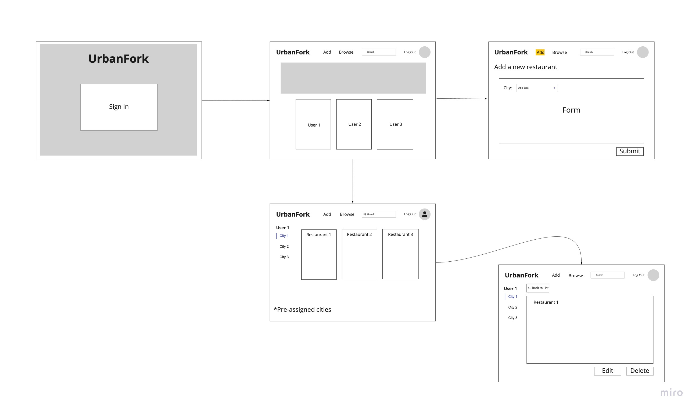
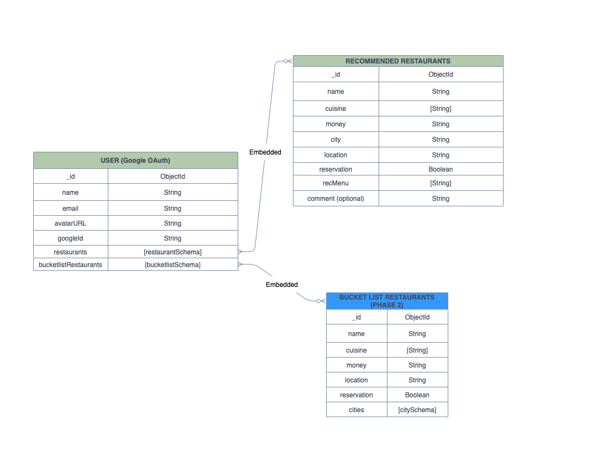

# UrbanFork
An app to share restaurant recomendations to fellow foodies.
This application was inspired by all our friends asking us for restaurant recomendations. We hope to inspire others to travel and try new types of food!

Click here to launch: http://urbanfork.herokuapp.com/

### User Story

On the main page:
- As a user (AAU), I want to log in using my gmail account to browse or make changes to my list.
- AAU, I want to search by name for other users to view their list.
- AAU, I want to click add to add new restaurants.
- AAU, I want to click on a certain user to browse their list of recommended restaurants.

On the restaurant list page:
- AAU, I want to filter restaurants by city.
- AAU, I want to view details of selected restaurant.

On the details page:
- AAU, I want to click edit or delete to update or delete a restaurant on my list.  

### User Flow

### Wireframe

### Data ERD 

---
### Resources:
Main page picture: https://pixabay.com/photos/fruits-crepes-breakfast-plates-1869132/

