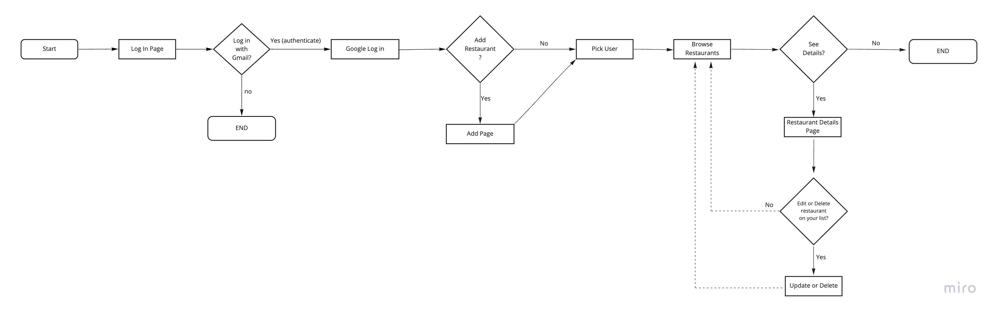
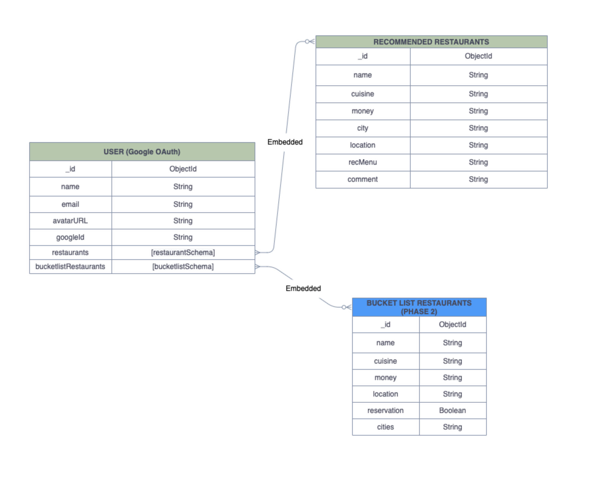

# UrbanFork
An app to share restaurant recomendations to fellow foodies.

### User Story
On the log in screen:
- As a user (AAU), I want to log in using my gmail account to browse or make changes.

On the main page:
- AAU, I want to click add to add new restaurants.
- AAU, I want to click on a certain user to browse their list of recommended restaurants.
- AAU, I want to view details of selected restaurant.

On the details page:
- AAU, I want to click edit or delete to update or delete a restaurant on my list.  

### User Flow

### Wireframe

### Data ERD 

    <% for (let i=0; i<profiles.length; i++){ %>
        <% let num = i; %>
    
        <a href="/profiles/<%=profiles[i]._id%>" class="d-flex align-items-center text-dark text-decoration-none">
            

                
                 
                <h3><%=profiles[i].name%></h3>
            

        </a>
     <% } %>
